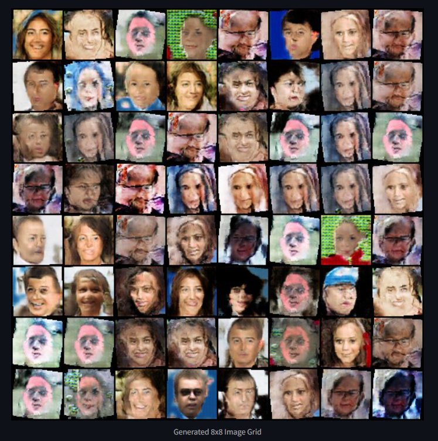

# Random Image Generation GAN

This project implements a Generative Adversarial Network (GAN) to generate random human face images. The model is trained on a dataset of 70,000 images and aims to produce realistic face images as output.

## Features
- **Generative Adversarial Network**: Trained using a generator and discriminator to synthesize realistic images.
- **Dataset**: Composed of 70,000 images for high-quality training.
- **Model Architecture**: Carefully designed generator and discriminator models for optimal performance.

## Training
The GAN is trained for multiple epochs to improve the quality of the generated images. After 450 epochs, the model showed notable improvements but continues to be refined for better results.

## Installation
To run this project locally, follow these steps:

1. Clone this repository:
   ```bash
   git clone https://github.com/sa778888/Random_Image_generator
   cd random-image-gan
   ```

2. Install the required Python packages:
   ```bash
   pip install -r requirement.txt
   ```

3. Ensure your system has the necessary hardware (preferably GPU) and CUDA installed for faster training.

## Usage
### Training
To train the model, run the notebook:
1. Open the provided Jupyter Notebook `Random_image_generatornotebook.ipynb`.
2. Follow the steps in the notebook to preprocess the data, build the GAN, and train the model.

### Generating Images
1. After training, use the generator to create random images.
2. Save the output images to your desired location.

## Results
Here are some examples of images generated by the model:




## Technologies Used
- Python
- TensorFlow/Keras
- numpy
- pandas
- Matplotlib (for visualizations)

## Future Improvements
- Enhance the generator and discriminator architectures.
- Experiment with different GAN variants like DCGAN, WGAN, etc.
- Incorporate larger or more diverse datasets.
- Fine-tune hyperparameters for improved training efficiency.

## Contributing
Contributions are welcome! If you have suggestions or improvements, feel free to create a pull request.

## License
This project is licensed under the MIT License - see the [LICENSE](LICENSE) file for details.

---

Happy generating! 🎨
